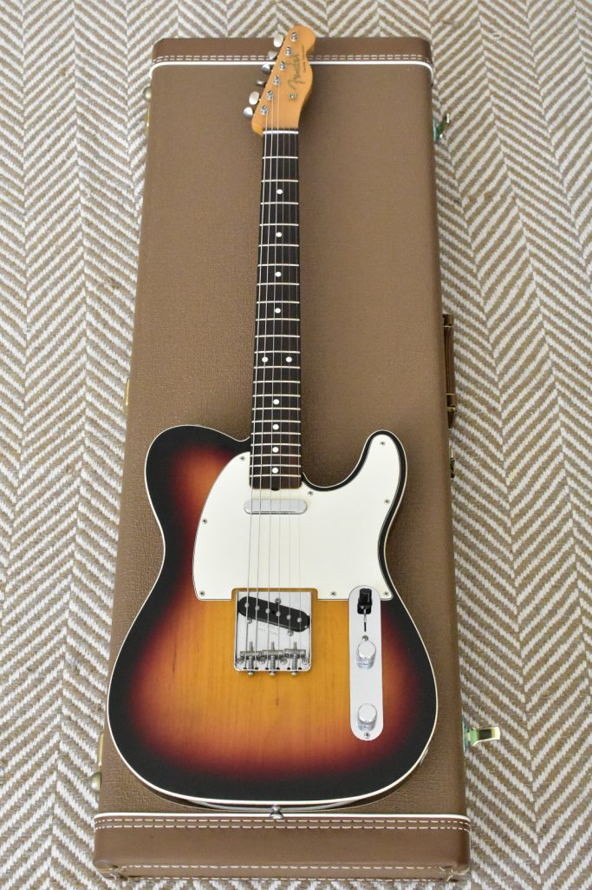
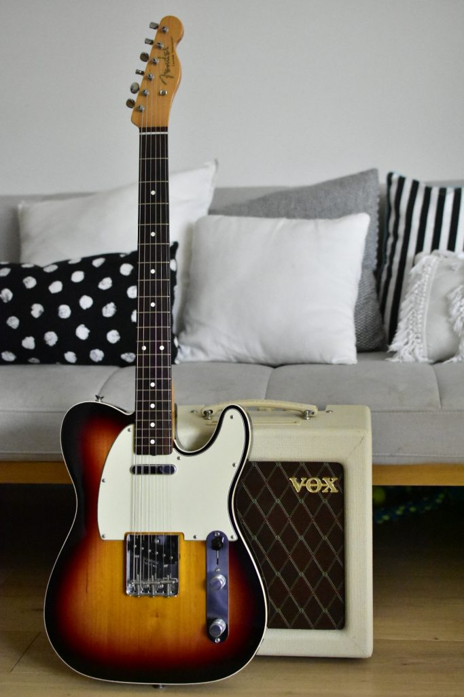
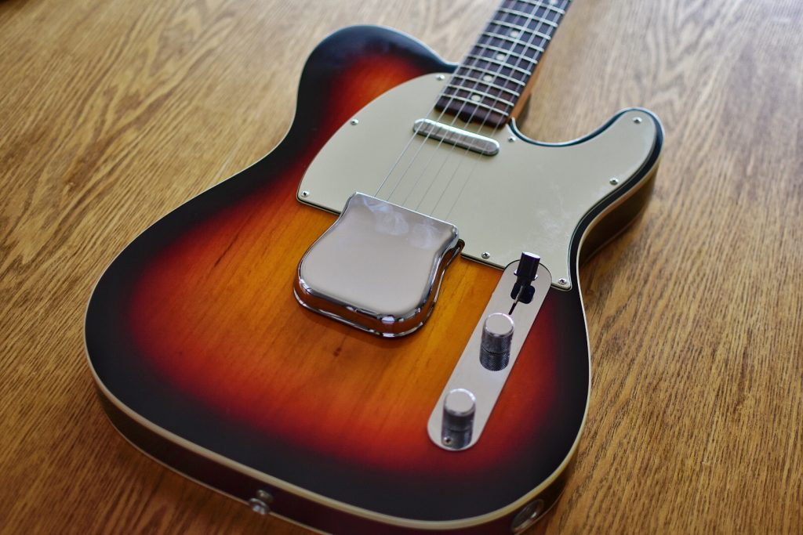
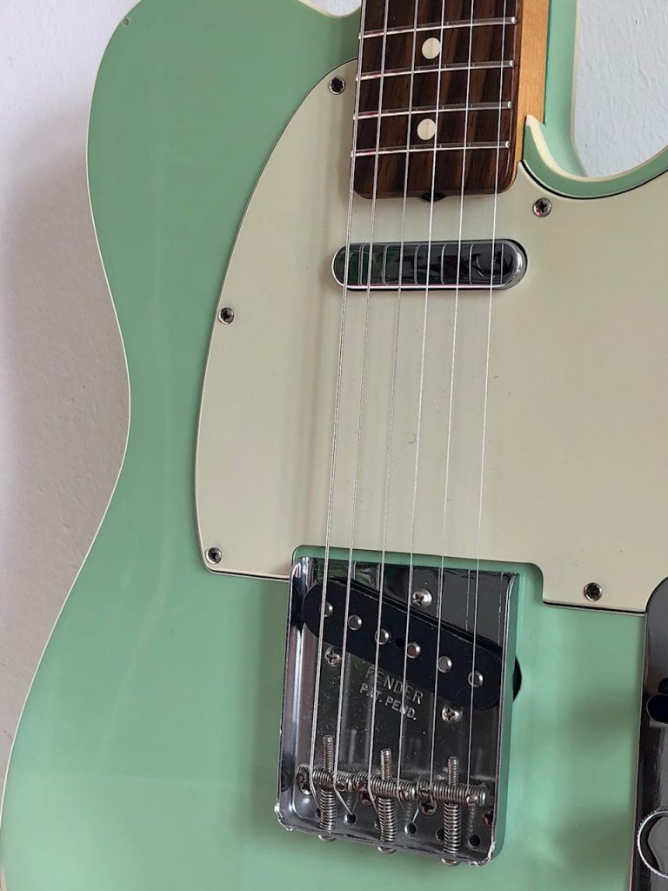
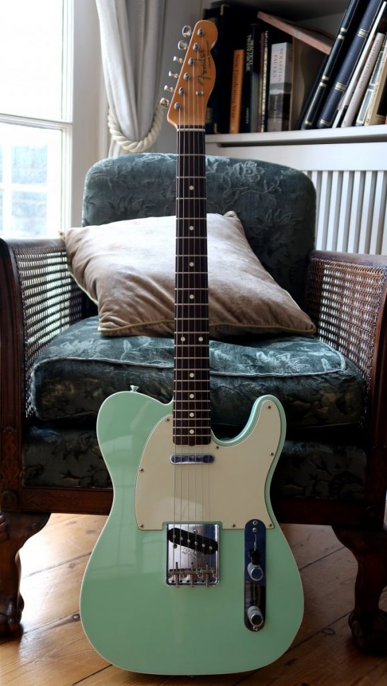
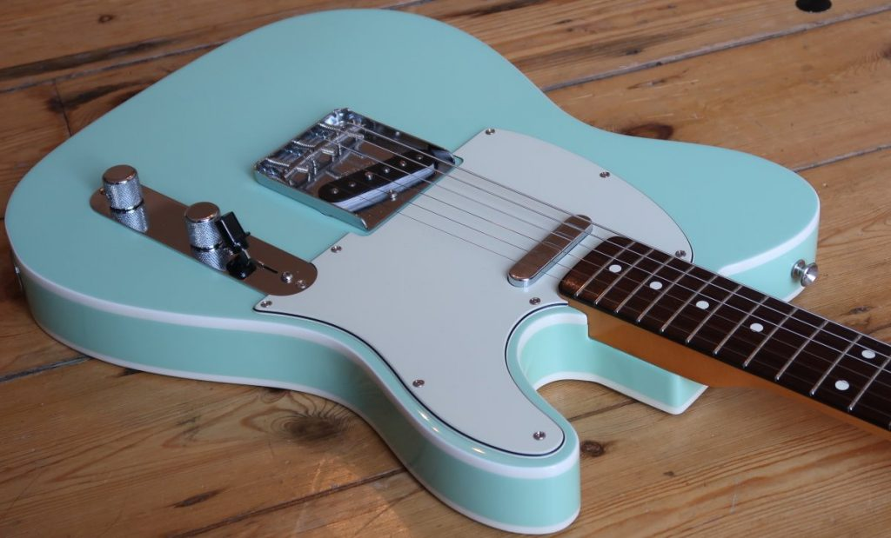
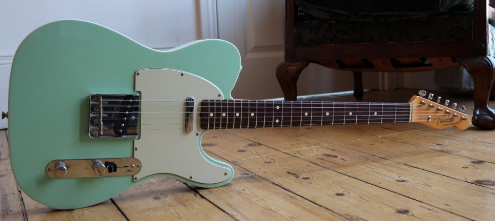

## The Story of the Custom Telecaster

The history of the American Vintage Reissue (AVRI) 62 Custom Telecaster starts with the introduction of the Custom Telecaster at the 1959 NAMM trade show in New York. It was merely a standard Telecaster with a bound body that gave it a stylish, up-market edge over the regular Tele model. It remained in the Fender catalogs until 1972 when it was replaced with the humbucker-equipped Telecaster Custom (1972 - 1981).

Fender advertised the binding in its 1959 catalog as “the binding not only adds to the attractive finish but also protects the edges of the guitar body”. The necks where Fenders new fast-action design that “permits rapid playing technique and comfortable full-chords right up to the end of the neck”. In 1962 Fender started rubber-stamping dates on the end of guitar necks rather than writing them in pencil. Until August 1962 Fender used flat-bottom 'slab' rosewood fingerboards. In the beginning of 1954 Fender switched the serial numbers from the bridge to the neck plate. Which is why the AVRI 62 Custom has the serial number stamped on the neck plate as opposed to [52 Telecaster Reissues](https://paulreno.de/52-telecaster/).

### **Custom Telecaster Colors**

During the 50s and 60s Fenders only in-house mixed colors where Sunburst, Blonde, and Candy Apple Red. The Custom Telecaster was available in Sunburst. For an additional 5% cost, Fender offered the following custom colors: Black, Blue Ice metallic, Burgundy Mist Metallic, Candy Apple Red, Charcoal Frost Metallic, Dakota Red, Daphne Blue, Fiesta Red, Firemist Gold metallic, Firemist Silver metallic, Foam Green, Inca Silver metallic, Lake Placid Blue metallic, Ocean Turquoise Metallic, Olympic White, Shell Pink, Sherwood Green metallic, Shoreline Gold metallic, Sonic Blue, Surf Green, and Teal Green metallic.

## **American Vintage Reissue 62 Custom Telecaster**

**V + 6 digits stamped on the neck plate**

1999 - 2012 Three-Color Sunburst
1999 - 2012 Black
1999 - 2000 Candy Apple Red
2001 Inca Silver
2001 Dacota Red
2001 - 2006 Ice Blue Metallic
2002 - 2006 Ocean Turcoise
2002 - 2012 Surf Green

- 
    
    AVRI 62 Custom Telecaster in Three-color Sunburst
    
- 
    
    AVRI 62 Custom Telecaster in Three-color Sunburst
    

Replicating original from 1962, the AVRI Custom 62 Telecaster was introduced in 1999 and featured the same historically accurate alder body, a rosewood slab fingerboard (with same 7.25" vintage radius), a 3-ply mint scratchplate, vintage Kluson Deluxe-style tuners and a set of matched AlNiCo 3 62 Custom Tele pickups. It came with threaded steel saddles and the bridge plate had the words FENDER PAT.PEND stamped on it.

The pickguard had a small U-shape incarving at the truss rod. Like the [52 AVRI Tele](https://www.paulreno.de/fender-52-telecaster/), the 62 Custom Telecaster came with vintage wiring and a kit to convert it to modern wiring (see AVRI 62 Custom Telecaster Service Diagram). It came in a brown tolex G&G case with orange lining. Probably inspired by the old 1962 “new fast-action design” neck the AVRI 62 Custom Telecaster had a really thin neck. The lacquer consisted of a urethane base coat under the nitro topcoat.

In 2010 the 69 Telecaster Thinline, the 72 Telecaster Custom, and the 72 Telecaster Thinline were added to the AVRI series. In contrast to the [AVRI 52 Tele](https://www.paulreno.de/fender-52-telecaster/) that came with a Certificate Of Authenticity (COA) until mid-2005 the other AVRI Fenders did not.

- 
    
    Notice the cavity under the bridge plate
    
- 
    
- 
    
- 
    

Fender AVRI 62 Custom Telecaster in Surf Green

### **AVRI 62 Custom Telecaster Specs**

- Body: Alder
- Neck: Maple, C Shape, (Nitrocellulose Lacquer Finish)
- Fingerboard: Rosewood, 7.25" Radius (184 mm)
- No. of Frets: 21 Vintage Style Frets
- Pickups: Two 62 Tele Custom Single-Coil Pickups (Neck & Bridge)
- Controls: Master Volume, Master Tone
- Pickup Switching: 3-Position Blade-
    - Position 1. Bridge Pickup
    - Position 2. Neck Pickup with Tone Control (Bright Vintage Circuit)
    - Position 3. Neck Pickup with No Tone Control (Dark Vintage Circuit)
- Bridge: Original Vintage Tele Bridge with 3 Threaded Steel Saddles
- Machine Heads: Fender/Gotoh Vintage Style Tuning Machines
- Hardware: Nickel/Chrome
- Pickguard: 3-Ply Mint Green
- Scale Length: 25.5" (648 mm)
- Width at Nut: 1.650" (42 mm)
- String Nut: Synthetic Bone
- Strings: Fender Super 250R, Nickel Plated Steel (.010-.046 Gauges)

## Other Versions

There has been a FSR (**F**actory **S**pecial **R**un) Limited Fender 62 Tele Custom in Olympic White which was part of the Telebration in 2011. Then there is the Fender Custom Shop (CS) 62 Custom Telecaster, the Made in Japan (MIJ) and Crafted in Japan (CIJ) 62 Custom Telecaster, and the Squier Classic Vibe 60s Custom Telecaster.

## Famous Players

- Andy Summers (The Police)
- Bruce Springsteen
- David Gilmour (Pink Floyd)
- Jamie Cook (Arctic Monkeys)
- John Frusciante (Red Hot Chili Peppers)
- Josh Klinghoffer (Red Hot Chili Peppers)
- Nicholaus Arson (The Hives)
- And many more...

## Downloads

- [Fender American Vintage Reissue 62 Custom Telecaster Service Diagram 1998](https://paulreno.de/wp-content/uploads/2020/02/Fender-American-Vintage-Reissue-62-Custom-Telecaster-Service-Manual-1998.pdf)

_Pictures by courtesy of @[rze99](https://www.tdpri.com/members/rze99.108855/) and @[dreamingtele](https://www.tdpri.com/members/dreamingtele.49218/)_
