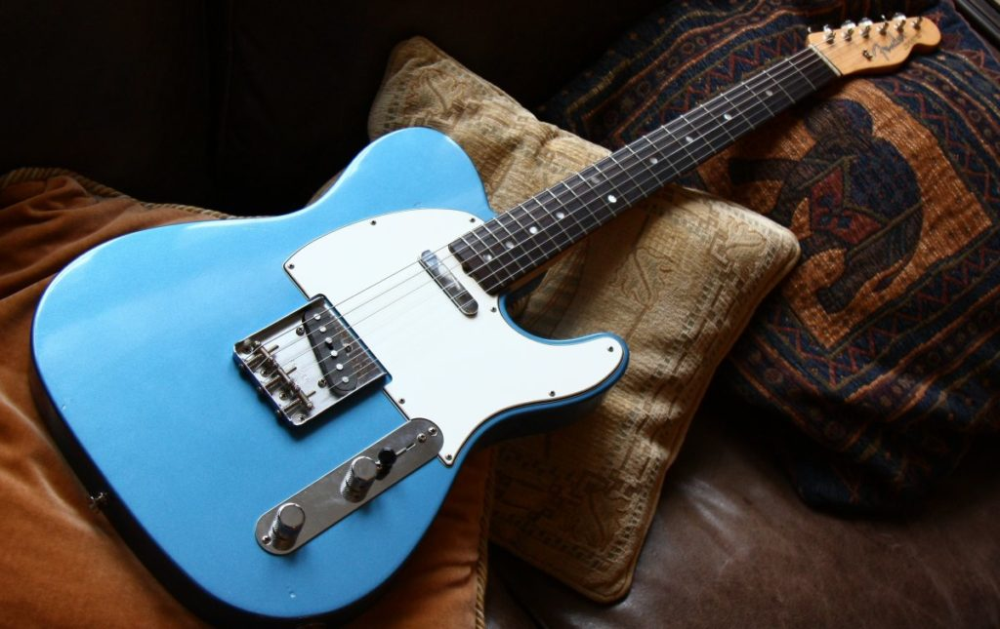
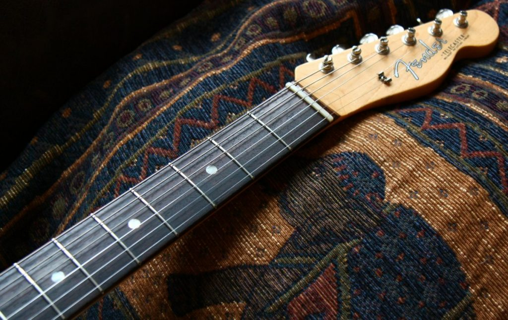
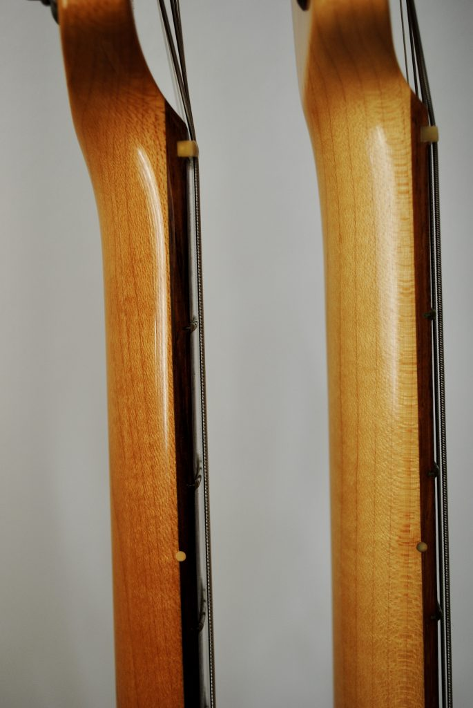
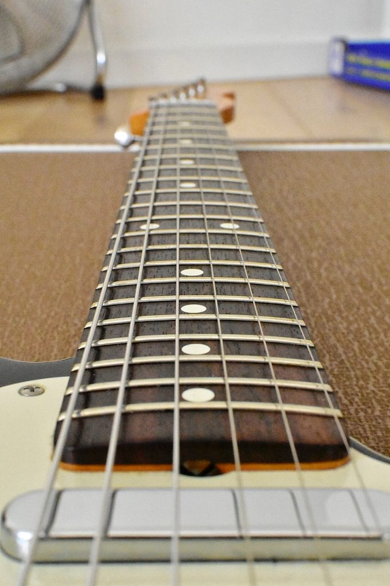
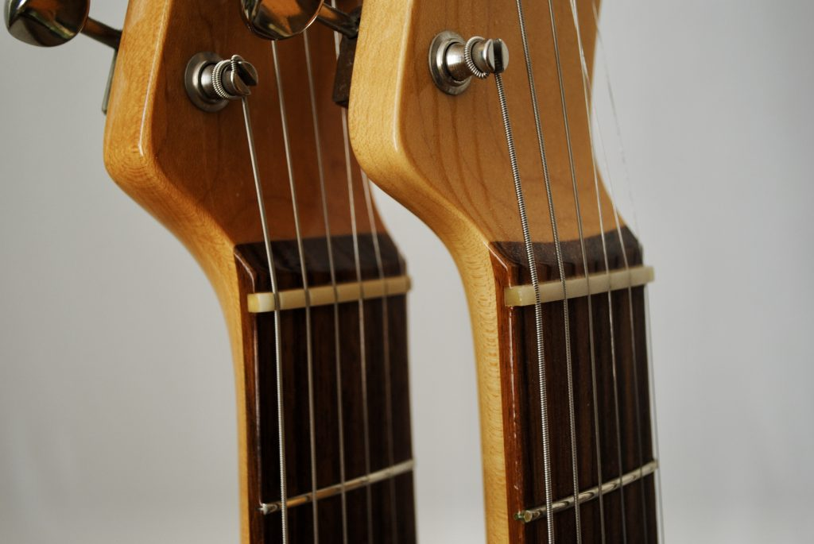
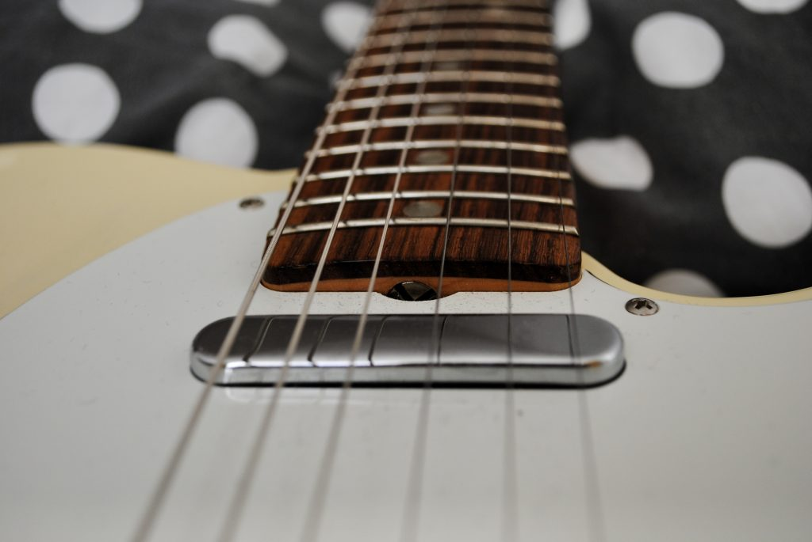
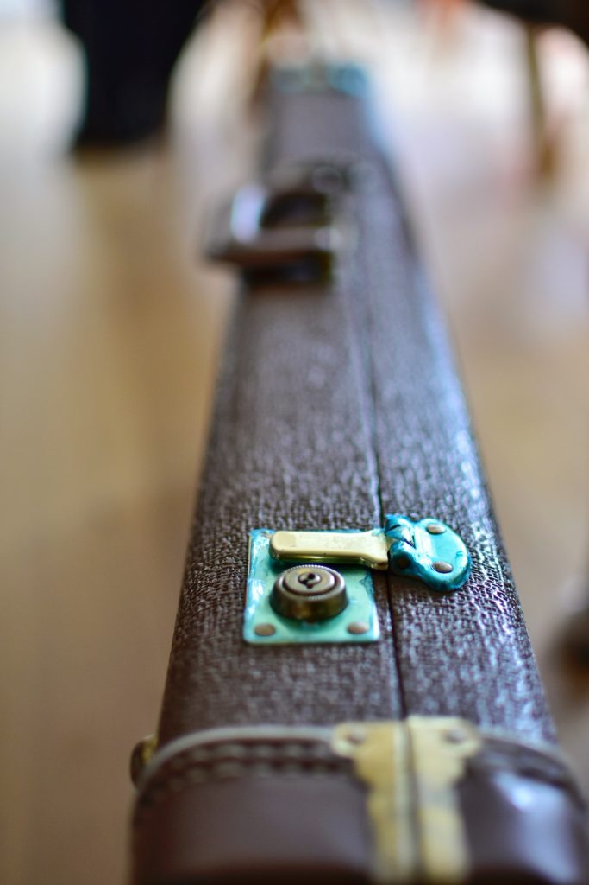
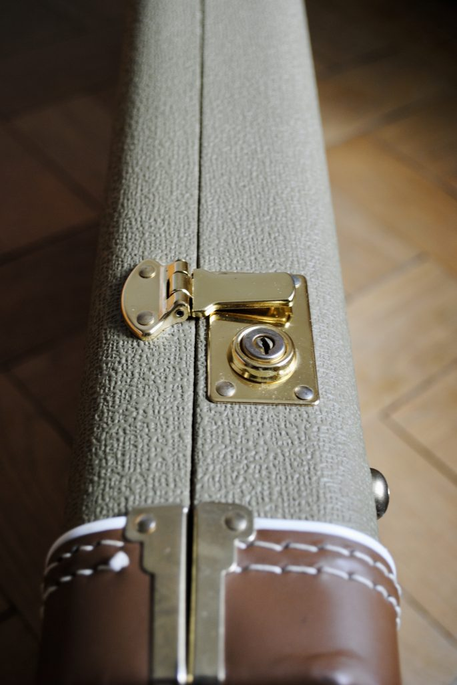
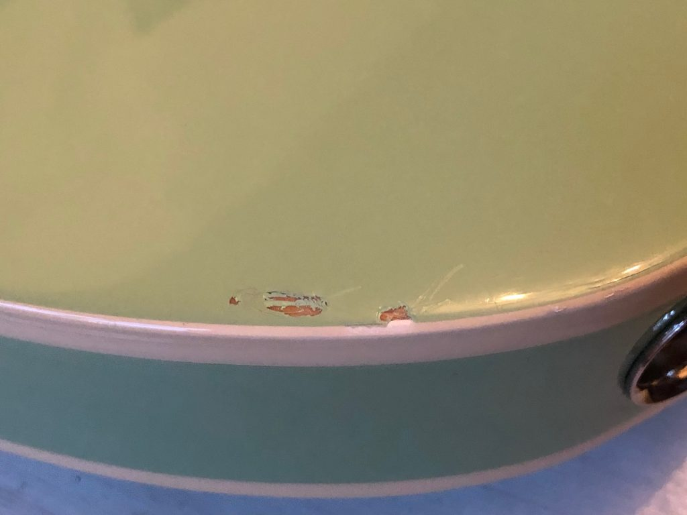
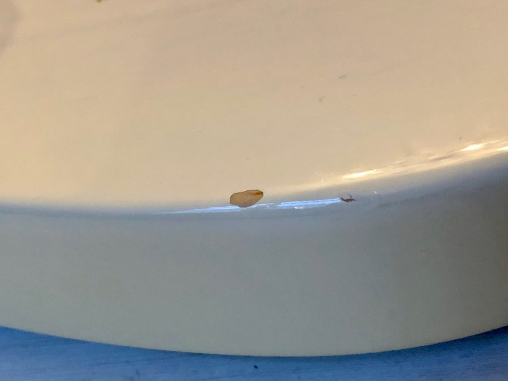

## The Story of the 1964 Telecaster

The history of the American Vintage 64 Telecaster reissue started back in 1964 when Leo Fender sold _Fender Electric Instrument Manufacturing Company_ for $13 million to CBS. In February 1965 CBS took over. This makes 1964 the last year for sought after pre-CBS Fender guitars. In late 1964 Pearloid fingerboard dots replaced the previous clay dots, with the smaller side dots becoming Pearloid. Since August 1962 flat-bottom slab rosewood fingerboards were replaced by thinner round-laminated fingerboards that made for a more stable joint between neck and fingerboard. These changes were the main ingredients for Fenders 2012 American Vintage Reissue.

## **American Vintage 64 Telecaster**

**V + 7 digits stamped on the neck plate**

2012 - 2017 Aged White Blonde
2012 – 2015 Three-Color Sunburst
2012 Lake Placid Blue
2013 Candy Apple Red
2014 Fiesta Red

In August 2012 the American Vintage 64 Telecaster (AV) which was advertised as 'Pure Vintage' at first replaced the [AVRI 62 Custom Telecaster](https://www.paulreno.de/fender-62-custom-telecaster/) (e.g. see the last page of the [Fender American Vintage Brochure from 2012](https://paulreno.de/wp-content/uploads/2020/02/Fender-American-Vintage-Brochure-2012.pdf)).

- 
    
    Fender AV 64 Telecaster in Lake Placid Blue.
    
- 
    
    Fender AV 64 Telecaster neck.
    

Like with the other AV models the first 46 produced 64 Telecasters came with a “1st 46” neck plate. Check out my post about the [52 Telecaster Reissues](https://paulreno.de/fender-52-telecaster/) you to read the 2012 Press Release.

The Pickups were changed to Alnico 5 magnets to add more focus and enhanced dynamics. On some of the AVRI 62 Custom Telecasters, one could see the pickup cavity under the bridge. Not so with the AV 64 models. Just like back in late 1964 Fender started using Pearloid fingerboard dots replaced the previous clay dots in late 1964, with the smaller side dots becoming Pearloid.

### Fender AV 64 vs AVRI 62 Custom Telecaster

The slab board of the [AVRI 62 Custom Telecaster](https://areyouexperiment.wordpress.com/2020/02/10/fender-62-custom-telecaster-reissue/) was changed to a round lam fingerboard and they used a period-correct headstock. The bridge plate now said FENDER PAT.NO. DES.164227 2,573,254.

- 
    
    AVRI 62 Custom (left) and AV 64 Telecaster neck (right)
    
- 
    
    Flat-bottom slab rosewood fingerboard of an AVRI 62 Custom Telecaster
    
- 
    
    AVRI 62 flat-bottom slab (left) and on AV 64 round-laminated rosewood fingerboard (right)
    
- 
    
    Round-laminated fingerboard of an AV 64 Telecaster: Notice how thin it is as compared to the fingerboard of the AVRI 62 Custom Telecaster
    

The neck lacquer on the AV 64 Telecasters is virtually untinted. In comparison, the AVRI 62 had an orange-ish heavily tinted neck. The AV ones are looking much lighter. The neck also is bigger and has rolled edges that give it a 'broken-in' feel. The frets are more rounded on the top giving them a feeling of being taller without actually being it.

The tolex of the AV cases looks more greenish than the brown tolex of the AVRI cases.

- 
    
    AVRI 62 Custom G&G Case
    
- 
    
    AV 64 G&G Case
    

The AV 64 Tele was the first one to have a Flash Coat Lacquer (supposedly the same lacquer as Fenders Thin Skin models). According to Rob Schwarz (Fender), the lacquer was all Nitro (Nitro Sanding sealer, Nitro color, and Nitro topcoat). All Fender AV models came with a [Lacquer Information Sheet](https://paulreno.de/wp-content/uploads/2020/02/Fender-American-Vintage-Lacquer-Information-2012.pdf) in the case. Since the lacquer was really thin sometimes even newly purchased Teles had some “finish issues” like small chips, dings, cracks, etc. There has been some speculation that this was one of the reasons why Fender replaced the AV series with the American Original (AO) that again uses the same body finishes as the AVRI (urethane base coat under lacquers).

- 
    
    Lacquer chip on a AVRI 62 Custom Telecaster
    
- 
    
    Lacquer chip on a AV 64 Telecaster
    

Notice how thick the paint is on the [AVRI 62](https://www.paulreno.de/fender-62-custom-telecaster/) in comparison to the AV 64 Telecaster.

Just like the rest of the AV series, the 64 Tele came with a thinner case and the modern wiring of bridge/both/neck standard and a kit to convert it to the vintage wiring (bridge/neck/neck with the tone capacitor) (see [AV 64 Telecaster Service Diagram](https://paulreno.de/wp-content/uploads/2020/02/Fender-American-Vintage-64-Telecaster-Service-Manual-2012.pdf)).  
It is also the first one that lets you identify the year of production by the serial number. If you have V**12** + 5 digits stamped on the bridge plate your guitar was made in 20**12**.

### **AV 64 Telecaster Specs**

- Body: Alder (all colored versions), Ash (Aged White Blonde)
- Neck: Maple, Mid 60s C Shape (Flash Coat Lacquer)
- Fingerboard: Round Laminated Rosewood, 7.25″ Radius (184 mm)
- No. of Frets: 21 Vintage Style Frets
- Pickups: Two American Vintage 64 Gray-Bottom Tele Single-Coil Pickup (Neck & Bridge)
- Controls: Master Volume, Master Tone
- Pickup Switching: 3-Position Blade:
    - Position 1. Bridge Pickup
    - Position 2. Bridge and Neck Pickups
    - Position 3. Neck Pickup
- Bridge: Original Vintage Style Tele Bridge with 3 Threaded Steel Saddles
- Machine Heads: Single Line “Fender Deluxe” Vintage Style
- Hardware: Chrome
- Pickguard: 3-Ply White with Vintage Bevel
- Scale Length: 25.5″ (648 mm)
- Width at Nut: 1.650" (42 mm)
- String Nut: Bone
- Strings: Fender USA 250R NPS (.010-.046 Gauges)

## Other Versions

Next to the Fender Custom Shop (CS) 1964 Telecaster there is the Made in Mexico (MIM) Classic 60s Telecaster.

## Famous Players

- Joe Strummer (The Clash)
- And probably many more...

## Downloads

- [Fender American Vintage 64 Telecaster Instruction Manual 2012](https://paulreno.de/wp-content/uploads/2020/02/Fender-American-Vintage-64-Telecaster-Manual-2012.pdf)
- [Fender American Vintage 64 Telecaster Service Diagram 2012](https://paulreno.de/wp-content/uploads/2020/02/Fender-American-Vintage-64-Telecaster-Service-Manual-2012.pdf)
- [Fender American Vintage Lacquer Information Sheet (2012)](https://paulreno.de/wp-content/uploads/2020/02/Fender-American-Vintage-Lacquer-Information-2012.pdf)
- [Fender American Vintage Brochure 2012](https://paulreno.de/wp-content/uploads/2020/02/Fender-American-Vintage-Brochure-2012.pdf)

__Pictures by courtesy of @[rze99](https://www.tdpri.com/members/rze99.108855/) and @[dreamingtele](https://www.tdpri.com/members/dreamingtele.49218/)__
