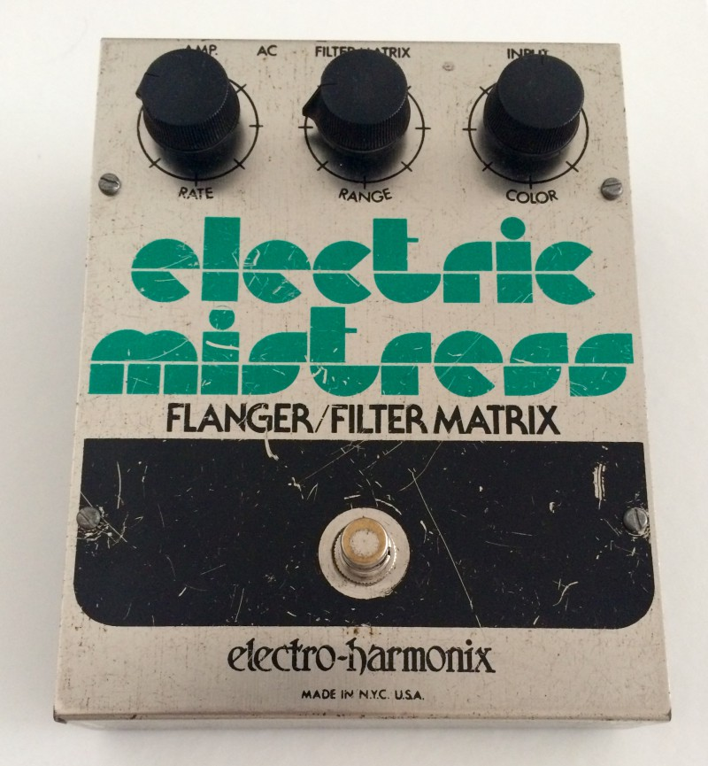

## What the flanger?

Like the Electro Harmonix (EHX) Electric Mistress flangers in general use two identical signals and one is delayed slightly by an LFO (Low-Frequency Oscillator). These signals are mixed with the guitar signal so they cancel each other out at certain frequencies. The delay time decreases and increases up to 20ms what produces a swirling 'jet' like effect.  
Back in the 60s and 70s bands like the Beatles used two tape machines to get a sound like that and recorded the results into a third one. E.g. you can hear that on 'Lucy In The Sky With Diamonds'.

## The History of the Electric Mistress

The Electric Mistress was developed by David Cockerell around 1975 and was the first flanger in a stompbox format. It was produced until 1985 with only small changes. It has a Rate, Range and Color knob and a switch to engage the Filter Matrix. It is driven by two 9v batteries or an 18v power supply.

### The Filter Matrix

The filter matrix switch stops the LFO and therefore the oscillation. The cancellations then stay at the same frequency what produces metallic-like sounds. With sweeping the Range knob you can change the frequency.

## Different Versions

With the very first V1 Electric mistress that had no Filter/Matrix switch, there are six different versions. The V2, V3, and V4 Electric Mistress are almost identical. On the V5 you only have to set the knobs a bit different but do get the same awesome sound.

Visit Ralf Metzger's [Electric Mistress Mystery](http://www.metzgerralf.de/elekt/stomp/mistress/index.shtml) Page for more detailed information on each version.

### Electric Mistress V1

**1976**

This is the only Electric Mistress that has a blueprinting and instead of the Filter/Matrix switch an On/Off switch. (PCB EH-5200-1-A)

### Electric Mistress V2

**1976 - 1978**

The V2 is the only (green) version that has no scale printed around the knobs. (PCB EH-5200-1-A)

### Electric Mistress V3

**1978 - 1979**

To find out if you have a V3, V4 or V5 Mistress you need to take a look at the Printed Circuit Board (PCB).  
The V3 Version has hand-drawn circuit paths (either all tin or with mask) and has EH 5200-1A printed on the PCB.

### Electric Mistress V4

**1979 - 1980**

The V4 (like some of the V3s) has a hand-drawn circuit paths and says EH 5200 1C on the PCB.

### Electric Mistress V5

**1980 - 1981**

The V5 has straight circuit paths with constant thickness and the EH-5100-D PCB.

### Electric Mistress V6

**1981 - 1984**

The V6 is the only version that has only one battery clip and works with 9V.

- 
    
    V5 Electric Mistress
    

## Where to put it

I tried the Electric Mistress with a lot of different pedals and amps. I recommend to put a flanger in the modulation section:

Where to put a flanger in the pedal chain

## Electric Mistress Settings

### **Andy Summers Tone**

To get Andy Summer's tone with the Electric Mistress is quite easy. In fact, I have to think of Andy most of the time when using the Electric Mistress. Here is a setting that I use. Remember to turn up the Rate if you are using version 1-4.

### **David Gilmour Tone**

Here is my David Gilmour setting on a V5 Mistress. On V1-V4 you will have to turn all knobs to 10 o'clock to get his sound.

Check out [Gilmourish.com](http://www.gilmourish.com/?page_id=80) to learn more about David Gilmour's tone.

Don't forget to [download the setting chart](https://paulreno.de/wp-content/uploads/2015/08/electric-mistress-setting-chart1.pdf) I made. Because whether you are in the studio or rehearsing for a live gig it is always useful to write down a setting that you like. So hopefully you will never sit in front of your Mistress and think 'What was the setting of that sound again?'

### Power Supply

Most of the vintage Electric Mistress pedals are being sold without a power supply. Unfortunately, the original power supply is no longer made and quite rare on the used market. Luckily I found an easy workaround that needs no modding at all:  
Just buy an Electro Harmonix 18DC-500 EU (in Europe) or an Electro Harmonix US18DC-500 (in the US) and use a 3.5mm male to 5.5mm x 2.1mm female DC power adapter connector that keeps the tip-positive polarity!

### Known Issues

Some people say they have a volume drop when using the pedal. Luckily I have none. But there is an easy [non-invasive mod](https://paulreno.de/volume-drop-drywet-mix-mod/) to solve that.  
Also, there are rumors about the pedal being noisy. It is a vintage pedal so I guess it will never be as quiet as your digital flanger plugin. But I only noticed a quiet noise when not playing what is totally acceptable for a vintage pedal.

### Trim Pots

Usually, you will never need to adjust the trim pots. But if you ever get a Mistress that sounds weird this might be the way to change that. If you open up the Mistress you can see two trim pots (small screws). The trim on the right is for the Delay IC. Move it to either side until the signal cuts out. Then set it in the middle of the two cutout points where the least distortion occurs. The pot on the left is for the Feedback. Turn it up and the pedal will oscillate (with the Color and Range set to max). Then turn it back until it stops oscillating.

### Best Flanger out There?

I compared this pedal to a lot of different flangers (e.g. Moogerfooger MF-108, Boss HF-2, EHX Flanger Hoax, EHX Deluxe Electric Mistress, Ibanez FL9, ...) and to me it is one of the best sounding flanger pedals out there.

## Famous Users

Andy Summers (The Police)  
Billy Corgan (The Smashing Pumpkins, Zwan)  
David Gilmour (Pink Floyd)  
Keith Levene (The Clash, Public Image Ltd)  
Robert Smith (The Cure, Siouxsie & the Banshees, The Glove, Malice, The Easy Cure)  
Robin Trower (Procol Harum, The Paramounts)  
And more...

## Downloads

- [Electro Harmonix Electric Mistress Settings Chart](https://paulreno.de/wp-content/uploads/2015/08/electric-mistress-setting-chart1.pdf)
