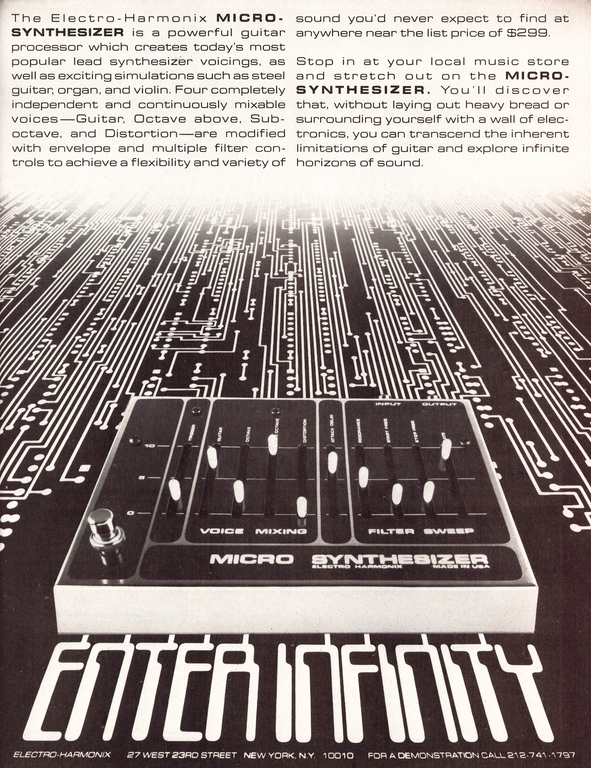
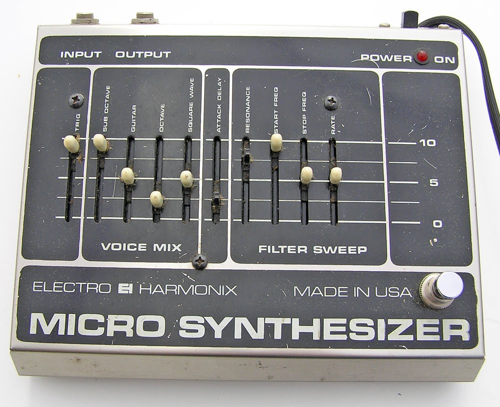
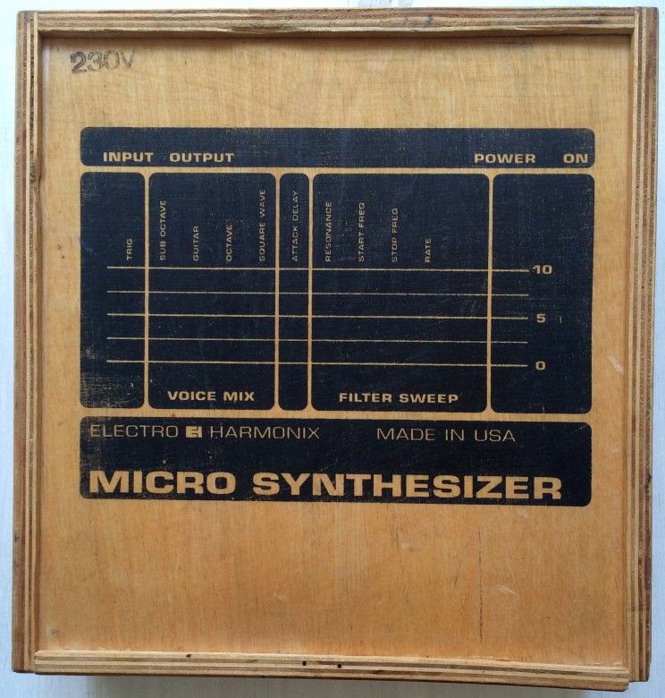
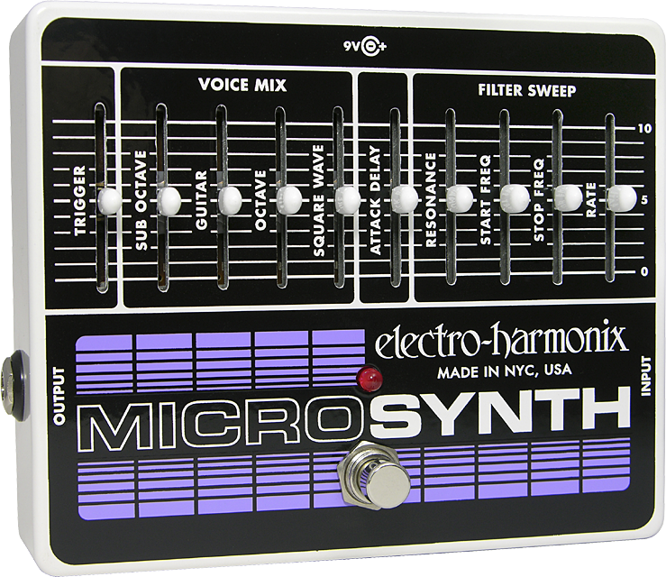

Like many of the great Electro Harmonix (EHX) pedals, the Micro Synthesizer was developed by David Cockerell. It is an all-analog design that features a 4 voice mixer and a 2-pole filter. The micro synthesizer creates different timbres by modifying the input signal into different circuits. It was inspired by the sound of the 1970's analog synths like Moog, Arp, Oberheim, and others.

## Different Versions

There is only little known about the different versions of the Micro Synthesizer. Here are the ones that I am aware of. Please contact me if you have any information!

### **V1 Micro Synthesizer**

**1979**

The first Micro Synth was released in 1979. It had no On/Off Switch on the backside and the Foot Switch was on the left side. In contrast to later versions, it had no LED and the square wave was labeled as distortion. It uses two circuit boards mounted on top of each other (like the V2 and V3). One for the basic circuit and another one that holds the sliders and links the controls to the mainboard.

- 
    
    V1 Micro Synth
    

### **V2 Micro Synthesizer**

**1980?**

The V2 was the first version with an On/Off Switch on the backside and an LED. The footswitch moved to the right. Like the original Micro Synthesizer, the V2 has a built-in power supply and came in a cardboard box.

- 
    

### **V3 Micro Synthesizer** **Reissue**

**1990?**

V3 is the Micro Synthesizer reissue and has a 24v wall wart. It uses the same components as the original units. Because Panasonic discontinued the production of the analog chips Electro-Harmonix had to purchase the remaining supply for the reissue version and probably stopped the production when they ran out of them.

- 
    
    Micro Synthesizer Reissue Wood Box
    

### **V4 XO Micro Synth**

**2000? - present**

The Micro Synthesizer XO is the newest version of the pedal. It is a complete redesign of the circuit and comes in a small metal case.

- 
    
    XO Micro Synthesizer
    

## Controls explained

### **Trigger**

The Trigger slider determines the input volume at which the filter circuits will be triggered.  
Don't set it too high, especially when playing chords because this will make the filter 'stutter'.

### **Voice Mix**

The four sliders set overall "mix" of the voices. Here you can control the completely independent output volume of the input signal, the Sub-Octave, the Octave and the Square Wave.

### **Attack Delay**

Sets the time required for the voice signals to reach full volume.

### **Filter Sweep**

The Resonance slider boosts the selected frequency and sets the degree of sharpness.  
The Start and Stop Frequency sliders determine the frequency at which the filter sweep starts/stops and the Rate sets how quickly the sweep occurs.

## Trim Pot

On the back of the Micro Synth V1, V2 and V3 there is a hole to access the trim pot. If you are using an instrument with higher or lower output than a guitar with single-coil pickups you can adjust the preamp gain with a small screwdriver. Turning the trim pot clockwise will increase the preamp gain and vice versa. On the XO version, you have to open the backplate to access the trim pot.

## Setting Chart

I have made a [Micro Synthesizer Setting Chart](https://www.paulreno.de/wp-content/uploads/2015/09/micro-synth-setting-chart.pdf) that I want to share with you. I hope it helps you to remember your favorite settings!

## Vintage vs Reissue vs XO Micro Synthesizer

Playing the Micro Synth is fun no matter what version you have. But there are some obvious differences if you compare them side by side.  
The V2 and V3 versions have a lot in common. But the sub-octave on the V3 is much more bass-heavy. It has a beefy low end and sounds very fat. The V3 has also a much better tracking and bypass than the V2. 
Compared to the XO both sound more raw and organic.  
Unfortunately, I was not able to get my hands on a V1 Micro Synth yet.  
The XO gets a plus point for its pedalboard-friendly size and the 9v connection. The bypass is also better than on the previous versions. But unfortunately, it sounds noticeably different. The square wave sounds very tame in comparison and does not give you that aggressive, raw, musical, vintage fuzz tone.  
So if you care about your sound I warmly recommend you to get the V3 Reissue Micro Synthesizer. It has the great vintage tone that you would expect, a good bypass and good tracking of the notes. Therefore it is superior to the V2 and XO.

## Famous Users

- Albert Hammond Jr (The Strokes)
- Eddie Van Halen (Van Halen)
- James Shaffer (Korn)
- Jamie MacColl (Bombay Bicycle Club)
- John Frusciante (Red Hot Chili Peppers)
- John Mayer (Solo)
- Kim Gordon (Sonic Youth)
- Matthew Bellamy (Muse)
- Sergio Pizzorno (Kassabian)
- And more...

## Downloads

- [Electro Harmonix V3 Micro Synthesizer Reissue Instructions Manual](https://paulreno.de/wp-content/uploads/2020/03/EHX-Micro-Synthesizer-Manual.pdf)
- [Electro Harmonix XO Micro Synth Instructions Manual](https://paulreno.de/wp-content/uploads/2020/03/EHX-Micro-Synth-Manual.pdf)
- [Electro Harmonix XO Micro Synth Sample Templates / Presets](https://paulreno.de/wp-content/uploads/2020/03/EHX-Micro-Synth-XO-Sample-Templates.pdf)
- [Electro Harmonix Micro Synthesizer Setting Chart](https://www.paulreno.de/wp-content/uploads/2015/09/micro-synth-setting-chart.pdf)
