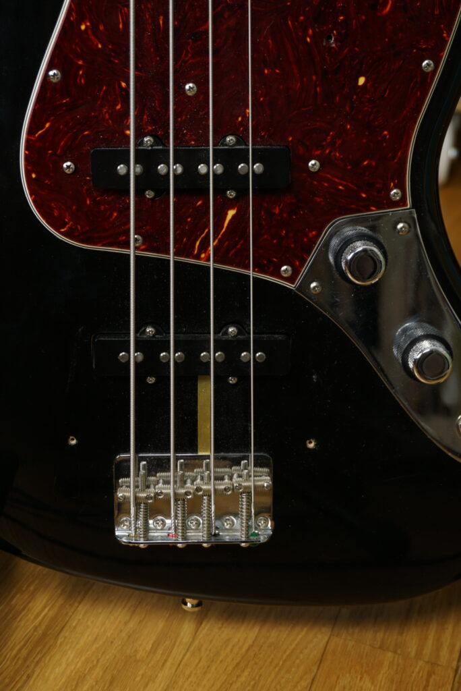

## History

It was in 1959 when Leo Fender and his team wanted to design a new deluxe bass guitar that went beyond the utilitarian vibe of the Precision Bass (which was released in 1951).

> "If the Precision was a Chevy, the new deluxe model would be a Ferrari"
> 
> Leo Fender

In 1960 the Deluxe Model was released in a sunburst, blonde, or custom-color finish and soon renamed the Jazz Bass. Similar to the Jazzmaster and Jaguar guitars the Jazz Bass has an offset lower bout to be more comfortable to play when seated. It had an unbound rosewood fretboard with "clay"-style dot markers, and a 34″ scale (which became the standard later on).

Until early 1962 the Jazz Bass came with a stacked-knob configuration. It had two tone and two volume knobs for each pickup. The concentric knobs were mounted on a chromed-metal plate. The volume was set with the upper knob and the lower knob controlled the tone.

The most noticeable changes to the Jazz Bass happened in 1965 after CBS bought Fender. Again, similar to the Jazzmaster the Jazz Bass received bound rosewood fingerboards with pearloid dot position inlays and oval-shaped tuning machines.

### Fender Jazz Bass vs. Precision Bass

A Jazz Bass typically has a thinner neck (17/16″ wide at the nut, compared to the Precision’s 13/4″), has two narrow, eight-polepiece pickups (instead of one on the Precision Bass) which deliver a more versatile tone (often described as richer in the midrange and treble). A Jazz Bass is also slightly larger and therefore usually heavier than a Precision Bass while maintaining the same body thickness.

## American Vintage Reissue 62 Jazz Bass

Fender American Vintage Reissue 62 Jazz Bass Black in Case

Subceeding the U.S. Vintage Reissue (1982-1998) the new American Vintage Reissue Series (AVRI) was introduced in early 1998. Even though Fender phased out stacked knobs on the Jazz Bass by 1961 the AVRI 62 came with them. It is possible though, that the the original 1962 Jazz Bass that Fender modeled the AVRI 62 after had stacked knobs (as Fender was known to utilize all leftover parts).

## American Vintage 64 Jazz Bass

Fender American Vintage 64 Jazz Bass Sunburst in Case

In August 2012 the new American Vintage Series (AV) – which was advertised as ‘Pure Vintage’ at first – replaced the AVRI Series. Fender supposedly spent hundreds of hours examining, measuring, weighing, x-raying and listening to vintage examples, resulting in improved finish quality, more vintage accurate neck dimensions, pickup tones and overall fit. In contrast to the AVRI 62 the AV 64 Jazz Bass came with a three-knob layout (two volume controls and one master tone control) and mounted bridge covers.

## American Vintage 64 vs American Vintage Reissue 62 Jazz Bass

Lets go thorugh some of the most obvious differences between the two basses.

The AV 64 Jazz Bass has a nitrocellulose finish while the AVRI 62 came with an urethane base coat under lacquers. The lacquer on the AV 64 is noticeably thinner and more prone to chipping. The lacquer on the AVRI 62 on the other hand is really thick and feels similar to the Japanese models.

- 
    
    Fender American Vintage 64 Jazz Bass Sunburst Pickups
    
- 
    
    Fender American Vintage Reissue 62 Jazz Bass Black Pickups
    

The AV 64 has a traditional three-knob layout and the pickups have flat poles. The AVRI 62 has the highly regarded stacked knobs and raised pole pickups.

- 
    
    Fender American Vintage 64 Jazz Bass Sunburst Tone Knobs
    
- 
    
    Fender American Vintage Reissue 62 Jazz Bass Black Stacked Tone Knobs
    

The headstocks and tuners are fairly similar but have some cosmetical differences. As you can see in the pictures the neck on the AV 64 Jazz Bass is untinted while the neck of the AVRI 62 is heavily tinted.

In contrast to the [AV '64 Telecaster](https://paulreno.de/64-telecaster/) Fender used clay colored dots on the AV 64 Jazz Bass. Unfortunately (and periodically incorrect) the dots are colored and not white. The AV 64 has a round laminated fretboard while the AVRI 62 has a slab board.

- 
    
    Fender American Vintage 64 Jazz Bass Sunburst Fretboard
    
- 
    
    Fender American Vintage Reissue 62 Jazz Bass Black Fretboard
    

Make sure to check out our [YouTube video](https://www.youtube.com/watch?v=ljtFcohzT14&t=10s) where Paul compares the two basses!

<iframe src="https://www.youtube-nocookie.com/embed/ljtFcohzT14" frameborder="0" allow="accelerometer; autoplay; clipboard-write; encrypted-media; gyroscope; picture-in-picture" allowfullscreen></iframe>
