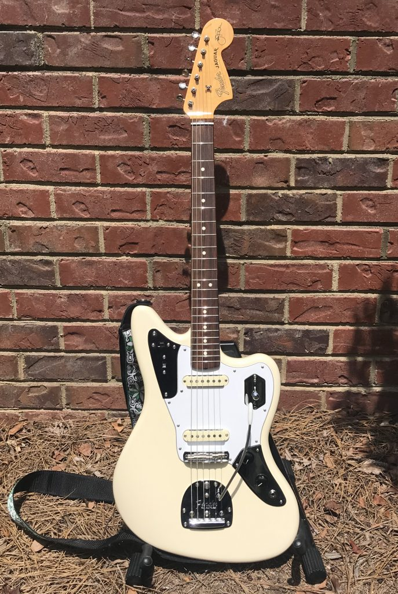
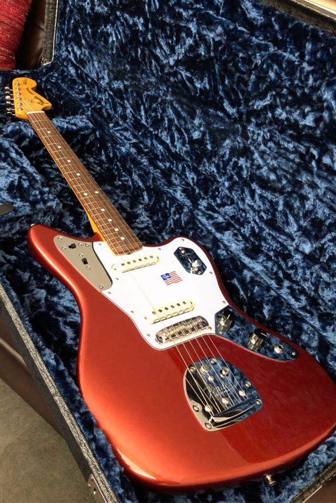
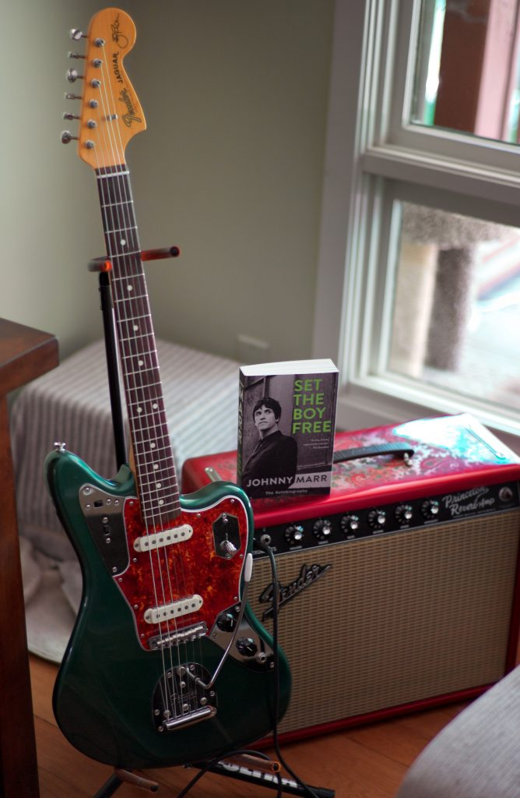
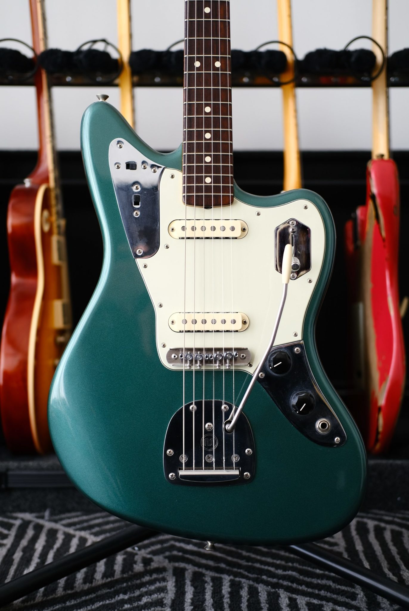
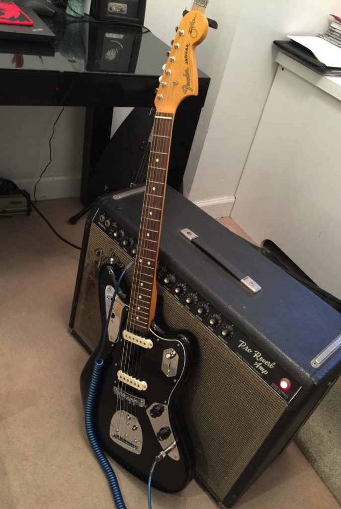
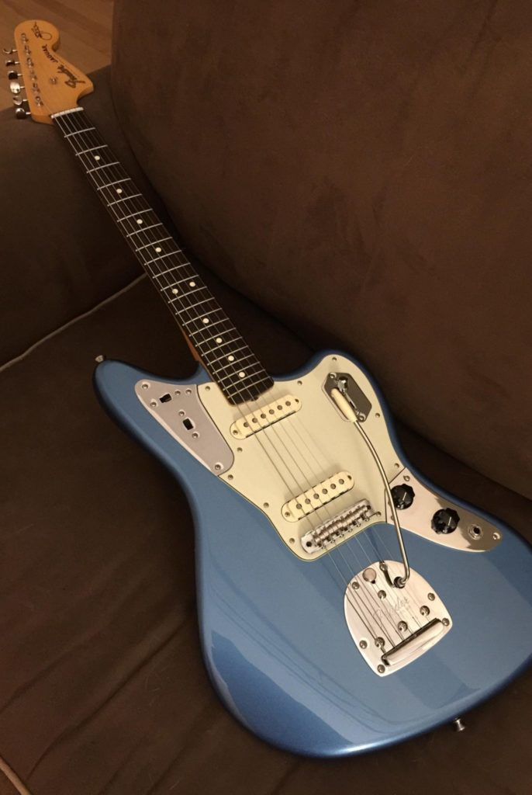

## The History of the Johnny Marr Signature Jaguar

Johnny Marr put a lot of time and thought into his signature model, which he developed with the help of Bill Puplett, whom he has worked with since 1988, John Moore, and Tim Mills. The development of the guitar took around three years where Johnny Marr played different prototypes exclusively on a few hundred shows and experimented, among other things, with different pickup configurations and different necks of vintage Jaguars. At NAMM 2012 the Johnny Marr Signature Jaguar was debuted in Olympic White and Metallic KO and the first 300 booklets were autographed by Johnny.

<iframe width="800" height="450" src="https://www.youtube-nocookie.com/embed/sPoUB9qBdg4" allowfullscreen></iframe>

_“I've taken all the aspects of the guitar in every direction I could, to improve it without losing the classic features that I liked from the original design. It's been a labour of love and obsession, and a privilege. I've used it for everything I've done since I started making it. It's my perfect guitar.”_ - Johnny Marr

## **Johnny Marr Signature Jaguar**

**V + 6 digits stamped on the bridge plate**

2012 - today Olympic White and Metallic KO
2014 Sherwood Green
2016 Black
2018 Lake Placid Blue

- 
    
    Fender Johnny Marr Signature Jaguar in Olympic White.
    
- 
    
    Fender Johnny Marr Signature Jaguar in Metallic KO.
    

The body of the Johnny Marr Signature Jaguar is a copy of Johnny Marr's 1963 Lake Placid Blue (LPB) Jaguar. It has a slightly more rounded forearm contour and a longer ribcage contour than modern Jaguars what makes it more comfortable to play. The neck is based on a 1965 Jaguar and is a bit thicker than on Jaguars of previous years, which is probably why Johnny Marr calls it “unusual”. Like the American Vintage guitars (e.g. the [52](https://paulreno.de/fender-52-telecaster/) and [64](https://paulreno.de/fender-64-telecaster/) Telecaster) it has smaller vintage frets and a curved fingerboard radius.

- 
    
    Johnny Marr Jaguar headstock with his signature
    

### Marr Jaguar Bridge

The first thing Marr, Puplett, and Moore did was to change the bridge. To stop the strings from slipping out the threaded rod saddles were changed to ones that can typically found on a Fender Mustang bridge. Moreover, the bridge screws that go into the body are designed with tight tolerances, are much wider than the ones that can be found on a usual Jaguar bridge, and use rubber bushings to prevent buzzing. The original Jaguar tremolo system was replaced with a [Staytrem](https://staytrem.com) tremolo that has a nylon insert at the vibrato arm collar what makes the arm stay put.

- 
    
    The Bridge and switching system of a Johnny Marr Jaguar
    

The early versions of the Marr Jaguar (2012 - 2017) came with a Staytrem bridge that had 55mm E-E spacing (Fender part No. 0091905000, see the [Service Diagram](https://paulreno.de/wp-content/uploads/2020/03/Fender-Johnny-Marr-Jaguar-Service-Manual-2012.pdf)). This E-E spacing resulted in people having trouble with the E strings falling off the fretboard. With the release of the LPB Marr Jaguar in 2018, the bridge assembly was apparently changed to a 52mm string spacing (Fender part No. 7712971000) on all colors of the Marr Jaguar, to solve this problem. If you have one of the earlier versions, you could order the new bridge separately. With this change, I suspect that small changes to the tremolo system were made too since the LPB Marr Jaguar tremolo arms aren't interchangeable between older ones.

### Bare Knuckle Pickups

In collaboration with Tim Mills from [Bare Knuckle Pickups](https://www.bareknucklepickups.co.uk) custom-wound Bare Knuckle Johnny Marr single-coil pickups were developed, based on the pickups from a 1962 Jaguar. During the development, they went through several different magnets and pickup wires to get the balance between the two right. Similar to Telecasters, the pickups are wound so that the polarity is the same on both instead of opposed. This leads to less interference when the strings are vibrating and thus gives them a more focused sound with very high articulation.

### Marr Jaguar Switching System

The original Jaguar three switch design lead circuit was replaced with a single four-way Telecaster style switchblade. This prevents the switches from accidentally being knocked or engaged. The first three positions are standard: bridge pickup, both in parallel, and neck pickup. But the fourth position puts the pickups in series where they act as one big humbucker, giving the Jaguar a unique darker sound.

To keep things simpler the original high-pass filter switch (mid-tone-cut), now called bright switch, was repositioned to the upper control panel where the rhythm/lead switch is normally found. To make the circuit more versatile a second filter switch was added to the top panel that acts as a high-pass filter. This switch is only active when the pickups are in series and gives the guitar more high end. Also, the height of the switches was lowered so they are less likely to be activated by accident.

<iframe width="800" height="450" src="https://www.youtube-nocookie.com/embed/_HQQSYa7nDg" allowfullscreen></iframe>

### **Johnny Marr Signature Jaguar Specs**

- Body: Alder
- Neck: Maple
- Neck Shape: Custom Neck Shape based on Johnny's 65 Jaguar®
- No. of Frets: 22 Vintage Style Frets
- Fingerboard: Rosewood, 7.25" (18.41 cm)
- Neck Plate: Vintage Style 4 Bolt
- Truss Rods: Original Vintage Style
- Pickups: Custom Wound Bare Knuckle Johnny Marr (Neck & Bridge)
- Controls: Master Volume, Master Tone
- Pickup Switching: 4-Position Blade:
    
    - Position 1. Bridge Pickup
    - Position 2. Bridge and Neck Pickups (Parallel)
    
    - Position 3. Neck Pickup
    - Position 4. Neck and Bridge Pickups (Series)
- Auxiliary Switching: 2 Slide-Switches:
    - Universal Bright Switch
    - Bright Switch for Blade Position 4
- Bridge: Jaguar® Bridge with Mustang Saddles and Vintage Style "Floating" Tremolo Tailpiece
- Hardware: Chrome
- Pickguard: 3-Ply White/Black/White and 3-Black/White/Black (on black ones)
- Scale Length: 24" (61 cm)
- Width at Nut: 1.650" (42 mm)
- String Nut: Synthetic Bone
- Strings: Fender USA Super 250R, NPS, (.010-.046 Gauges)

- 
    
    Maggie's Johnny Marr Signature Jaguar in Sherwood Green with Spitfire Tortoiseshell Pickguard
    

### **Marr Jaguar Colors**

Next to the standard colors, Olympic White and Metallic KO Fender made a couple of different colors over the years. They have not been advertised as limited runs by Fender but since the colors were only in production for one year their numbers are limited.

In 2014 Sherwood Green was released and appeared in the YouTube video for [“Easy Money”](https://www.youtube.com/watch?v=9_P5iSG_APE). According to Fender, 250 of them were made. A Black on Black was released in 2016 and supposedly 600 of them have been made. Coincided with the release of Johnny Marr's Call The Comet album (listen to it on [Apple Music](https://music.apple.com/de/album/call-the-comet/1362676938), [Spotify](https://open.spotify.com/album/14um9vHDZsoNRn28ymg9DQ), or [YouTube Music](https://music.youtube.com/playlist?list=OLAK5uy_mzRdWpWFcv1-fP5IsFxIwPZsrPCJrlmv4)) a Lake Placid Blue Marr Jaguar was released in 2018 and around 850 of them were made.

Fender seemed to have made custom colors for Johnny Marr. Additionally to one in Sherwood Green Fender posted a [picture on Instagram](https://www.instagram.com/p/bsLCzbuYct/) where a Candy Apple Red and a Silver (or Comet) Sparkle one can be seen.

- 
    
    William’s Sherwood Green Johnny Marr Signature Jaguar.
    
- 
    
    Jahn’s Johnny Marr Jaguar in Black.
    
- 
    
    Fender Johnny Marr Signature Jaguar in Lake Placid Blue.
    

## Famous Players

- Ed O'Brien (Radiohead)
- Gabriel Winterfield (Jagwar Ma)
- Johnny Marr
- Nathan Willett (Cold War Kids)
- Nick Zinner (Yeah Yeah Yeahs)
- Taylor Swift
- And others…

<iframe width="560" height="315" src="https://www.youtube-nocookie.com/embed/QMLvtre39Zs" allowfullscreen></iframe>

## Downloads

- [Fender Johnny Marr Signature Jaguar Service Diagram 2012](https://paulreno.de/wp-content/uploads/2020/03/Fender-Johnny-Marr-Jaguar-Service-Manual-2012.pdf)
- [Fender Johnny Marr Signature Jaguar Booklet 2018](https://paulreno.de/wp-content/uploads/2020/03/Fender-Johnny-Marr-Jaguar-Booklet-2018.pdf)

_Pictures by courtesy of @[jahn](https://thegenerationofmusic.wordpress.com), @[maggie](https://www.flickr.com/photos/mediawench/), and @[williamjohnbennettiii](https://www.instagram.com/williamjohnbennettiii/)_
