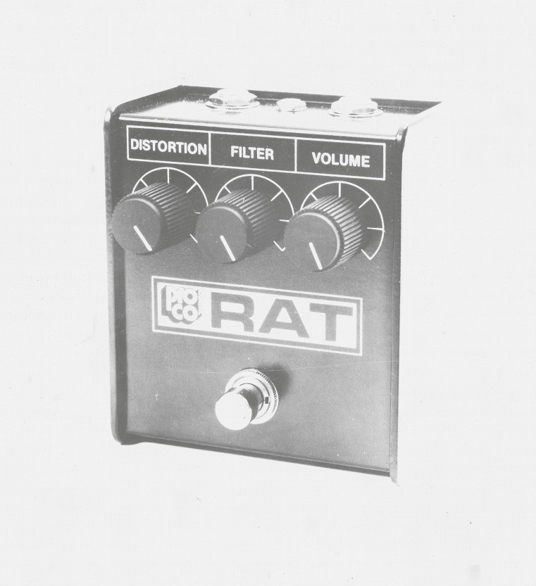
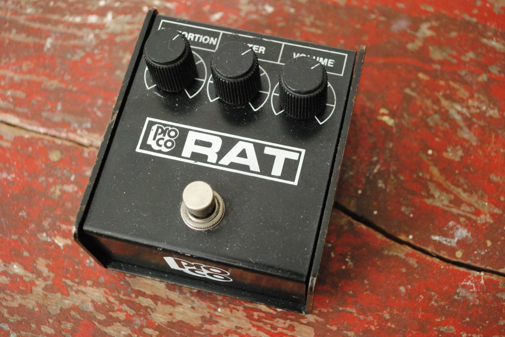
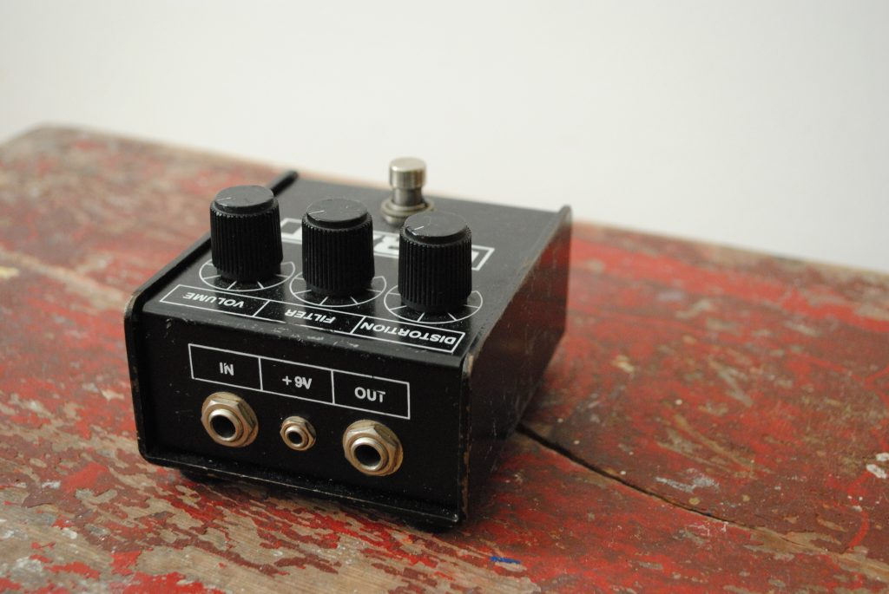
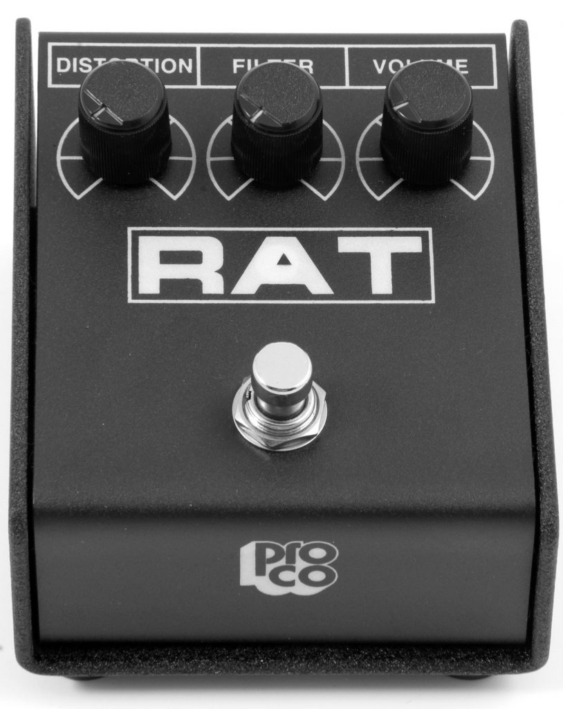

## What the RAT?

The RAT is a distortion pedal developed by Pro Co. It has a very simple circuit with a single operational amplifier, the Motorola LM308 (later pedals use the Texas Instruments OP07DP). Just like in the Boss DS-1 the RAT's distortion is made by a hard-clipping of the input signal. But in contrast to the DS-1, the RAT uses a different op-amp and has a passive tone filter. It has a Distortion, Filter and Volume knob and is either driven by a 9v battery or a 9v power supply with 3.5 mm plug (with positive tip).

### History

In the 70s Scott Burnham and Steve Kiraly repaired and modded distortion pedals in a basement in downtown Kalamazoo, Michigan. When they decided to design their own superior distortion pedal in 1978, the first RAT was born. It was the so-called 'Bud Box' RAT of which only 12 pedals were made and was never intended to be a mass-produced product.

## Different Versions

### **The RAT V1**

**1979 - 1981**

Pro Co began mass-producing the RAT in 1979. The top panel of the V1 was labeled with 'Pro Co Sound The RAT' and had three knobs: Distortion, Tone, and Volume.

### **The Rat V2**

**1981 - 1983**

It is the first version that had a Filter instead of a Tone control. The filter cuts the high frequencies as it is turned clockwise. The logo was changed from the uppercase 'RAT' to 'Rat'.

- 
    
    The Rat V2
    

### **RAT**

**1984 - 1988**

In 1983 Pro Co introduced the smaller, U-shaped RAT that had the same circuit as the V2.

- 
    
    Vintage ProCo RAT
    
- 
    
    Vintage ProCo RAT
    

- 
    
    The backside of a vintage Rat
    

### **RAT 2**

**1988 - present**

RAT 2 was introduced in 1988 and had the same enclosure as the previous RAT. It features a red status LED and glow-in-the-dark graphics. Over the years some changes were made.

- 
    
    RAT 2
    

**1995**: Pro Co started phasing out the LM308 op-amp. So if not modded post-1996 RAT 2s have an OD07DP.

**2003**: The RAT 2 now comes in the same sloped enclosure as the Turbo RAT.

**2008**: The production moved to China and is there being manufactured by Neutrik.

### **Vintage Rat**

**1991 - 2005**

In 1991 ProCo made a reissue of the Vintage Rat that was produced until 2005. In contrast to the original The Rat the logo of the reissue Vintage Rat did not say "Sound Inc." next to ProCo and had a battery compartment at the bottom.

Some of this content can also be found at the official RAT website at [ratdistortion.com](http://www.ratdistortion.com).

## Dating a Rat (Or Any Vintage Gear)

If you ever get your hands on a RAT 2 with a flat enclosure and want to determine when it was made you will have to look at the six- or seven-digit number on the back of the potentiometers. With the following instructions, you can date any pot and therefore date most of your vintage gear (e.g. vintage amps or guitars). Keep in mind though, that the pot must be original to the piece and that it only indicates when the pot was manufactured.

The first three numbers stand for the manufacturer (although there are some with one, two or four digits) and the 4th and 5th numbers for the year. As example:

`1 3 7 **8 5** 0 9`

The `137` says that it was made by CTS (see manufacturer list below) and the `85` tells you that it was made in `19**85**`!

**List of the most common pot manufactures**  
`106` = Allen-Bradley  
`134` = CentraLab  
`137` = CTS (Chicago Telephone Supply)  
`140` = Clarostat  
`304` = Stackpole  
`381` = Bourns Networks  
`615` = IRC (International Resistive Company)

The Guitar Dater Project has a useful [Pot Code Reader](https://www.guitardaterproject.org/potcodereader.aspx) that can help you with manufacturers that subscribed to the Electronics Industries Alliance (EIA).

## Modifications

With the RAT having a rather simple layout it is a popular pedal for modifications. I would not recommend you to mod your vintage Rat. But for the newer versions, there are interesting mods like swapping the op-amp for the original LM308 or upgrading the capacitors. Check out the [Pro Co RAT Wiki](https://en.wikipedia.org/wiki/Pro_Co_RAT#Popular_modifications_to_the_RAT) entry for an overview of popular modifications.

## LM308 VS OP07DP or Vintage VS Reissue

I spent hours playing an old RAT 2 with the LM308 next to a new RAT 2 with the OP07 op-amp and could tell a noticeable difference. I am not an expert in electronics therefore I do not know if it is only because of the different op-amps. The rest of the circuit probably does play a role too. Although the basic character of the pedal is in both, the LM308 has more thickness without getting muddy. It sounds smoother, fatter, bassier and the dynamic response of the pedal is just awesome.  
The overall sound is tighter and the articulation is better. The OP07, in contrast, sounds fuzzier, harsher and not as crunchy to me.

## Famous Users

- Alex Turner (Arctic Monkeys)
- Andy Summers (The Police)
- Dave Grohl (Foo Fighters)
- Derek Whibley (Sum 41)
- Frank Black (Pixies)
- Graham Coxon (Blur)
- Jeff Beck (The Yardbirds)
- Joe Perry (Aerosmith)
- Joe Walsh (Eagles)
- Johnny Buckland (Coldplay)
- Johnny Greenwood, Thom Yorke (Radiohead)
- Justin Lockey (Editors)
- Kim Gordon (Sonic Youth)
- Krist Novoselic, Kurt Cobain (Nirvana)
- Peter Buck (REM)
- Peter Holmstrom (Dandy Warhols)
- Russell Lissack (Bloc Party)
- Thurston Moore (Sonic Youth)
- Tom Linton (Jimmy Eat World)
- And others...

## Downloads

- [ProCo The Rat Owners Instructions Manual](https://paulreno.de/wp-content/uploads/2020/03/ProCo-The-Rat-Owners-Instructions.pdf)
- [ProCo Rat 2 Owners Instructions Manual](https://paulreno.de/wp-content/uploads/2020/03/ProCo-Rat-2-Owners-Instructions.pdf)
