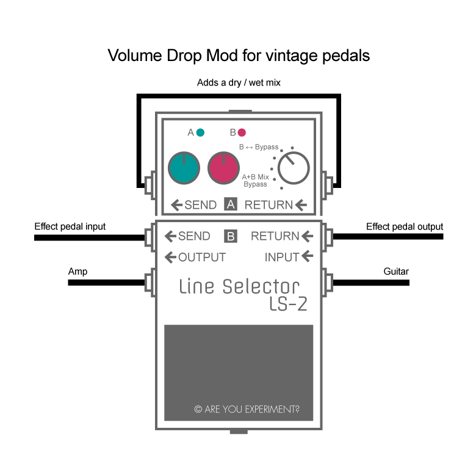

In this post I want to show you a simple volume drop mod. There are some disadvantages that come with vintage pedals (like the MXR Phase 90 or the Electro Harmonix Electric Mistress):

1. Some of them have a lower output volume or a bad buffer
2. Most vintage pedals don't have a dry/wet mix
3. Almost all of them have no status LED

That is why I wanted to share this easy non-invasive trick that solves all three issues: the Boss LS-2!

If you want to compensate a volume drop set the LS-2 to 'B BYPASS' and turn the red knob clockwise to get more volume.

To add a dry/wet mix set the LS-2 to 'A+B MIX BYPASS' and add a patch cable from Send A to Return A (see picture above). Use the green knob to set the amount of the dry signal and adjust the volume with the red knob.

This way you can easily add a dry/wet mix to your vintage pedal and compensate a volume drop. The LS-2's LED shows you whether the effect is engaged or not.
